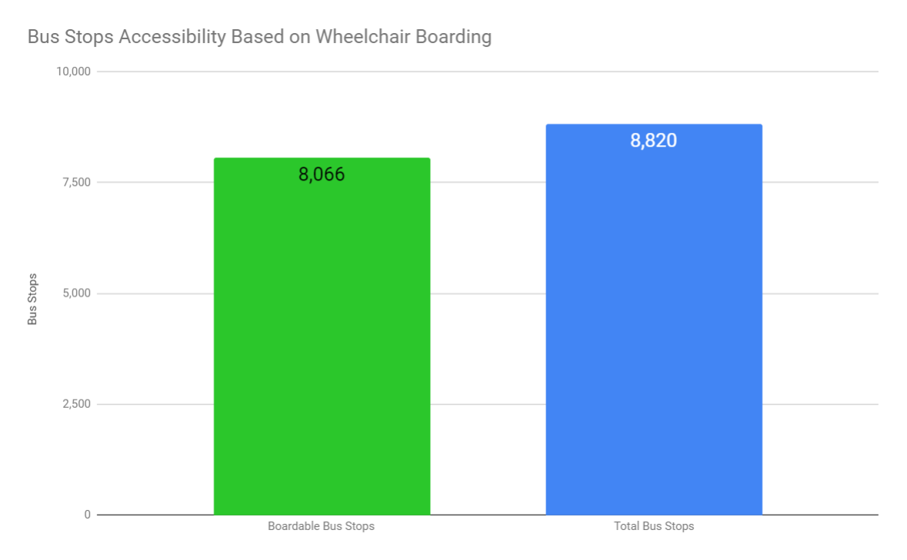
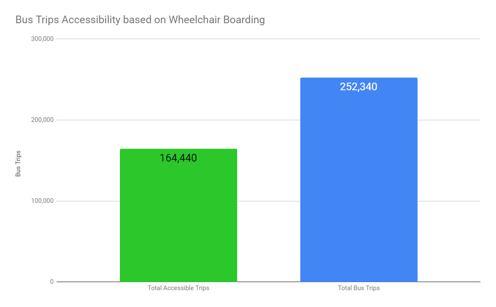
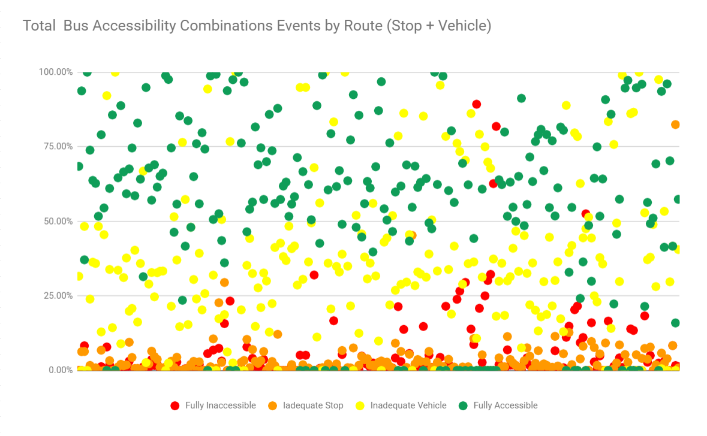
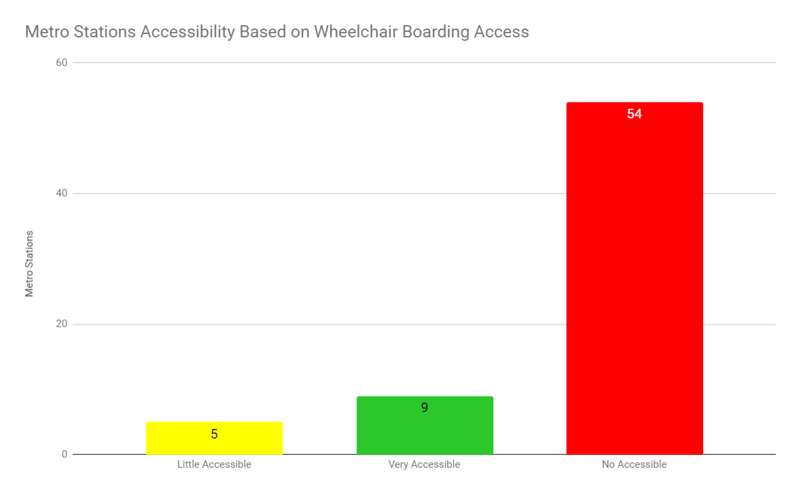

 

# Montreal Public Transport Accessibility

## Context

- The current project analyze the availability of accessibility in the STM system. 
- The actual analysis involves boarding accessibility in the Metro Stations, Bus Stops and Bus Units. 
- The goal is to provide a more detailed approximation about the global access in the STM for people with mobility limitation, including people using wheelchairs and parents with kids that require strollers. This accessibility is also helful for users with bikes who need plublic transport to complete of their full journey. 
- According to the STM "[All vehicles are wheelchair accessible](https://www.stm.info/en/access/using-public-transit-wheelchair), with the exception of minibuses operated on Navette Or shuttles and the 212 - Sainte-Anne line.". However based on the `schedule for buses with ramp at the front` is possible to guess that not all of them have the complete ideal equipment.
- At the [bottom of this readme](https://github.com/diliscia/stm_accessibilty_review/blob/main/README.md#stm-accessibilty-review-metodology-notes), more details about the methodology used.

---

#### Caveat
- In the data is not available the actual number of STM bus units. However using the trips information it was possible to create a proxy value called `bus trips`.
- Is not clear in the data how is computed the total of services offered.
- *wheelchair_boarding* is related to the Bus Stop or Metro Station infrastructure, "wheelchair boardings are possible from the location".*
- *wheelchair_accessible* refers to the vehicle, "used on this particular trip can accommodate at least one rider in a wheelchair."
[STM data dictionary](https://developers.google.com/transit/gtfs/reference)
---

### Bus Stops Accessibility based on Wheelchair Boarding

- 91% of all Montréal Bus stops have Wheelchair Boarding Accessibility. Is important to mention that the same access also can be used for bikes. According to the STM site all the STM buses are properly equipped to securely carry wheelchairs and bikes. This accessibility is also relevant for parents with small kids in strollers.

### Bus Trips Accessibility Based on Wheelchair Boarding

- Since it was not possible to find the number of bus units, the variable *wheelchair_accessible* related to the trips was used.
- The same bus can do more than one trip, but it won't change during the trip.
- Based on the results, 65% of the bus trips are indicated as Wheelchair Accessible. That differs from the `All vehicles are wheelchair accessible` information at the STM website.
- It's possible that the variable *wheelchair_accessible* in the trips data is defined with a different approach and that the 35% gap could be related to the availability of the `ramp at the front` or number of wheel_chairs that can be accomodated inside the unit.

### Total Bus Accessibility Oportunities (Stop + Unit)

- Accessible stops are not enough, the person with reduced mobility requires an Accessible unit and to have boarding accessibility in the starting and ending stops.
- An event is defined as the combination of a trip and a stop. 
- Based on the data it was proposed a Bus Accessibility Opportunity index:

    - When the stop is `boarding accessible` and the trip is `wheelchair accessible` the event is defined as `fully accessible`.
    - When the stop is `boarding accessibile` but the trip is not `wheelchair accessible` the event is defined as `inadecuate vehicle`.
    - When the stop is not `boarding accessibile` but the trip is `wheelchair accessible` the event is defined as `inadecuate stop`.
    - When the stop is not `boarding accessibile` and the trip is not `wheelchair accessible` the event is defined as `fully_innaccessible`.
    
- The data shows that just 2.5% of all the events are Fully Inaccessible and 63.7% are Fully Accessible. 
- The 31.2% of the events are not accessible due to the vehicule. This could cause some valid frustration to the users, however there are good propbabilities to have an approtiated vehicule in the next trip.

### Total Bus Accesibility Oportunities by Routes (Stop + Unit)

- Data shows consistency by showing well defined areas or clouds of event points even distributed overall the routes. It can be seen that the Fully Accessibile events are between 50% and 100% present in all the routes and that the Fully Innaccessible events are located mostly below the 25% with the few isolated cases that are analized in the following. 
- Three routes have 100% Fully Accessibility, 13-Christophe-Colomb, 77-Station Lionel-Groulx / CUSM and 193-Jarry, followed by other routes with high Fully Accessibility events percentage. This routes are mostly located in the [Centre of the Metropolitan Area of the city](http://www.stm.info/sites/default/files/pdf/fr/plan_reseau.pdf). 
- Over 67% of the routes have more than 50% of Fully Accessibility events, while the other events (Inadequate Vehicle, Fully Inaccessibility and Inadequate Stop) have a presence below 50% each in more than 80% of the routes. Actually more than 95% of the Fully Inaccessibility and Inadequate Stop events are present in less than 20% of the routes.
- The routes with more Fully Inaccessibility events (superior to 50%) are 212-Sainte-Anne, 219 Chemin Sainte-Marie, 220-Kieran and 419-Express John Abbott, three of which travel through the [Autoroute 40](http://www.stm.info/sites/default/files/pdf/fr/plan_reseau.pdf) or operate in [West-Island](http://www.stm.info/sites/default/files/pdf/fr/plan_reseau.pdf).

### Metro Stations Accessibility Based on Wheelchair Boarding

- However, there is significantly room for improvement in the Metro Stations. 
- Only 14 (20%) of the 68 Montréal Metro Stations have at least one entrance with Wheelchairs Boarding Accessibility. 
- In order to provide more details, it was proposed an Accessibility Index to compute the total of entrances with Wheelchair Boarding Accessibility based on the total number of entrances:

    - If more than the half of the entrances to the station have Wheelchair Boarding Accessibility it is considered that is a `Very Accessible Station`. 
    - If less than half of the entrances have Wheelchair Boarding Accessibility it is considered a `Little Accessible Station`.
    
- Is interesting to notice that 9 stations have more than half of the entrances with Wheelchair Boarding Accessibility.

---
## Conclusion
- The Montréal Bus offer seems pretty friendly for users with reduced mobility.
- Despite the fact that the Metro Accessibility is not offered widely in the [system](http://www.stm.info/en/info/networks/metro), the biggest stations are properly equiped with elevators to facilitate the secure access with wheelchair.
- Some Metro Stations are accessible in most of the half of the entries access.
- Based on the STM website, improve accessibility in the system is a priority and the data could help to find the best and more impactfull oportunities for the affected users.

## Next Steps
* Cross the data with traffic and trips usage capacity, to validate the best times for people with reduced mobility to use the public transit.
* Map the most accessible friendly routes in Montreal.
* Cross the accessibility data with cultural routes or any other activities, in order to offer the best options to users with reduced mobility.
* Follow the improvement of the accessibility in the whole network through time. 

---
---

 

# STM Accessibilty Review. Metodology notes

## Data exploration and tools
- For this analysis it was used public data was accesible on the [STM.com website](http://www.stm.info/en/about/developers). 
- The data was downloaded on February 2021 and according to the `calendar` table contains data related to the trips from October 26th 2020 to March 21st, 2021 
- The analysis was done using SQL.

## Data ask
With the main purpose to use data analysis on public transit accessibility, the objetive is to provide more details about the real accesibility to the Bus and Metro in Montreal, using as proposed metrics: the access to Metro the stations and posibility to use the bus service offered by the STM.

## Data Quality test
- Some data was duplicated due to malformed names in the metro stations (accents, dash or numbers to idnetify the metro entrance). Some cleaning was perfomed to remove the duplications.
- The total of trips in the data were validated using the public information on the STM website.
- The total of available Bus units os not available, however the total of trips is consistent with the public information on the STM website. 

## Data Modeling and Analysis

Four SQL queries were required to model and perfom the initial data exploration:
- **bus_stop_wheelchair_boarding**: to validate the total of bus stops adecuate for users on wheelchair.
- **bus_trips_wheelchair_accessibility**: to validate the total of bus trips adecuate for users on wheelchair.
- **metro_stations_wheelchair_boarding_accessibility**: to validate the total of metro stations with adecuate access for users on wheelchair
- **total_bus_accessibility_opportunities_stops_plus_units**: combining the bus stops data and the trips accesibility, to create an index based on the total ooporunities to effectively board a accessible vehicle from an accesible stop.
- **total_bus_accessibility_opportunities_by_route.sql**:

All queries are included in SQL files (sql_code folder).
